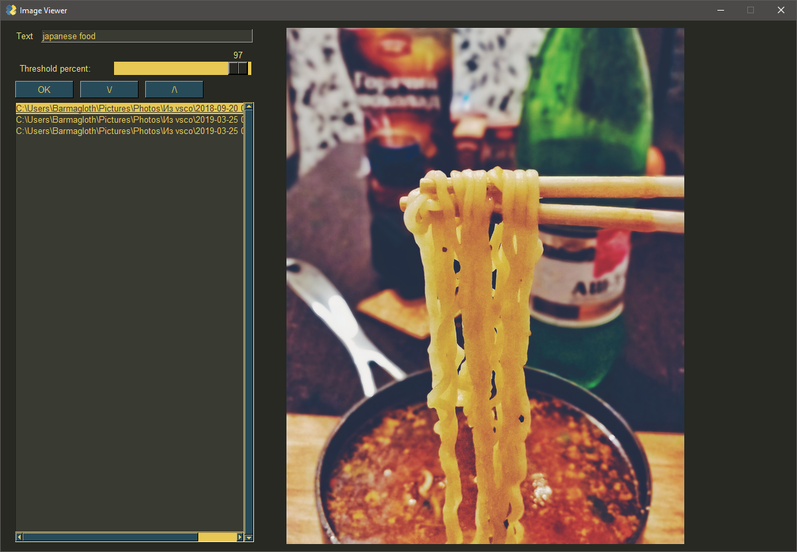
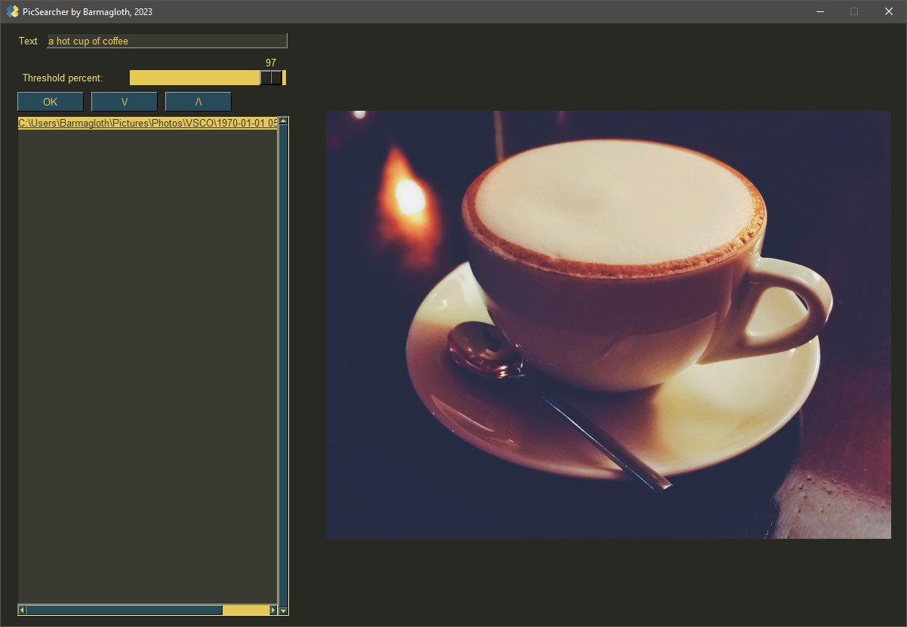
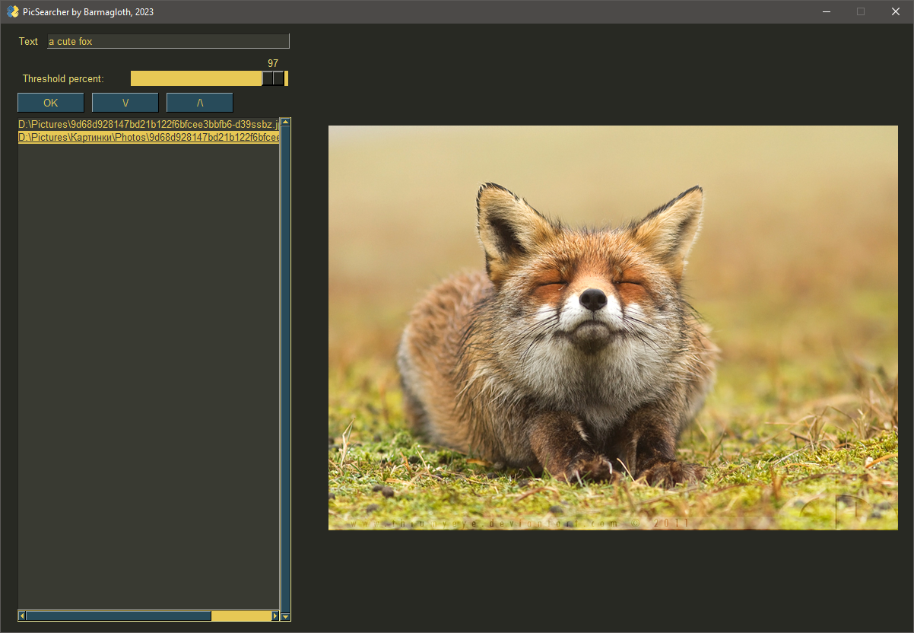
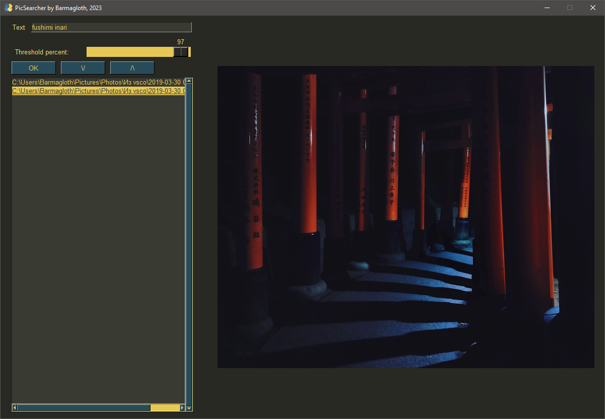

# PicSearcher

PicSearcher is a Python-based tool designed to search for images based on textual descriptions. This tool utilizes the CLIP model from OpenAI for understanding images and text in the same semantic space. 

Simply speaking, it searches for pictures by their description.

# Samples

</img>
</img>
</img>
</img>

## Note

Please note that the OpenAI CLIP model used in this project requires a significant amount of computational resources. You may need a machine with an NVIDIA GPU to run this program efficiently.

## Installation

1. Ensure you have Python 3.10+ installed on your machine. 
2. Please check https://pypi.org/project/torchvision/ table before installing `torch` and `torchvision` and find versions suitable for you. 
Also, if you have CUDA drivers, it makes sense to use a `cu` versions, which you can always obtain here: https://download.pytorch.org/whl/
If you do not know which ones do you need, just uncomment `torch` and `torchvision` lines in `requirements.txt`
3. Install necessary dependencies by running `pip install -r requirements.txt` in your terminal.
5. Set up your MySQL database ( I used [MariaDB](https://mariadb.org/download) ) and ensure you update the `db_connect()` function in `data_processors.py` with your MySQL credentials.

## Usage

1. Run `python Indexer.py` to index folder with your images. The first run downloads the CLIP model, so it may take a time. Also, the indexation speed depends on how many images do you have in folder (*sincerelly, capt. Obvious*). 
2. Run `python main.py`, enter your search query and set a similarity threshold in the GUI. It's kinda ***strictness*** of how the search will follow your prompt.
3. Click 'OK' to perform the search. The program will then display a list of images matching your search query.

This project is an excellent example of using cutting-edge machine learning models for practical applications. Please note that as of the date of this readme, the project only supports .jpg, .png, and .jpeg image formats.

## Components

- `data_processors.py`: This script contains the necessary utility functions and MySQL database interfacing capabilities. The key functionalities in this file include establishing a connection to the MySQL database, creating the necessary tables for storing image data, preprocessing images using the CLIP model, selecting a folder of images to process, and serializing and deserializing tensors (representing image data).

- `Indexer.py`: This script is responsible for indexing all the images in a specified folder. It processes the images, obtains features from the images using the CLIP model, and then stores these features in a MySQL database. Images with width and height below a certain size are not processed. Duplicate entries are ignored.

- `Searcher.py`: This script is responsible for searching for images based on text input. It takes an input text and calculates similarity with features of indexed images in the MySQL database. If the similarity crosses a threshold, the image path is returned.

- `main.py`: This script is the entry point for the PicSearcher application. It provides a simple GUI for users to input a text query and a similarity threshold. It then displays the list of images that are similar to the input text according to the threshold.

## License

This project is under the [MIT License](LICENSE.md). Note that the CLIP model from OpenAI is used under its own [license](https://github.com/openai/CLIP/blob/main/LICENSE).
